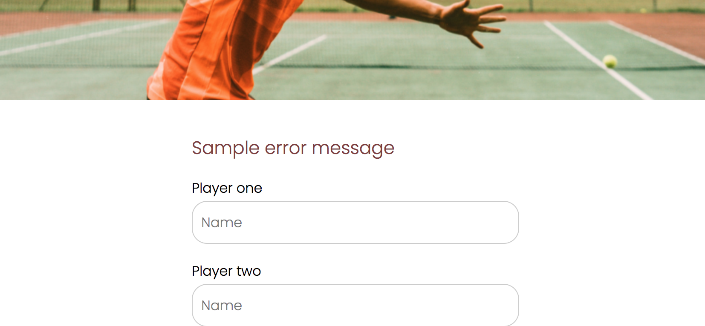
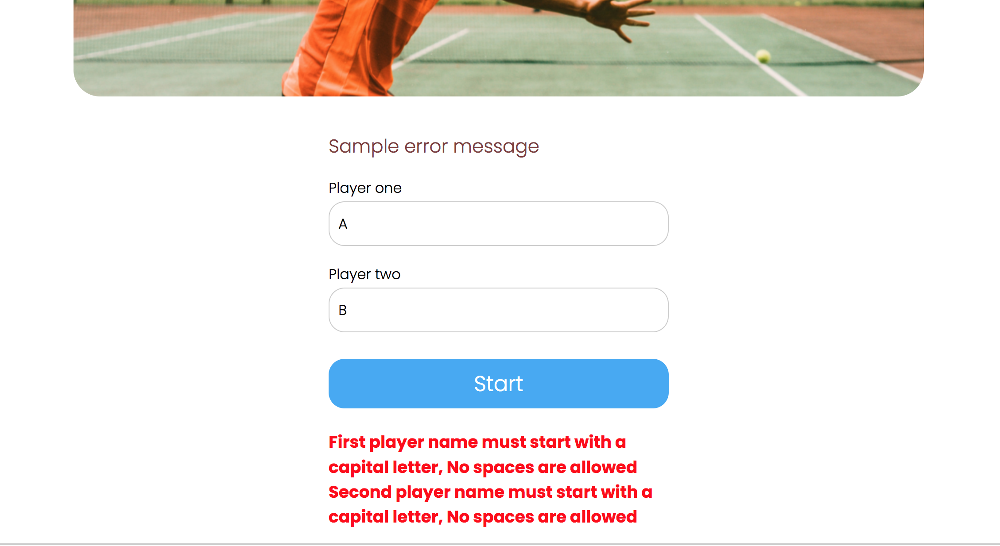
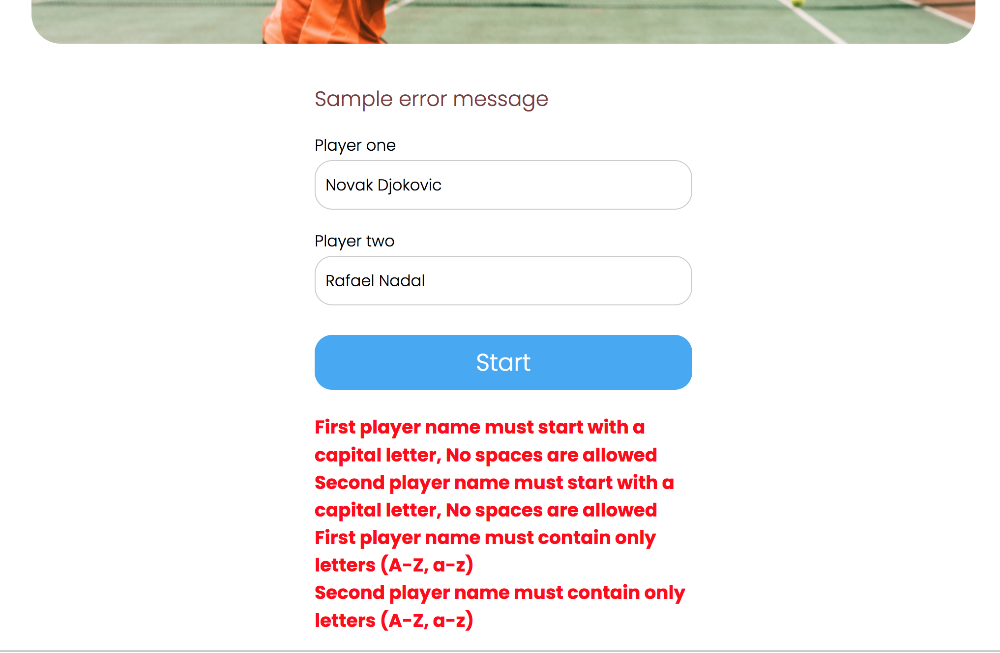
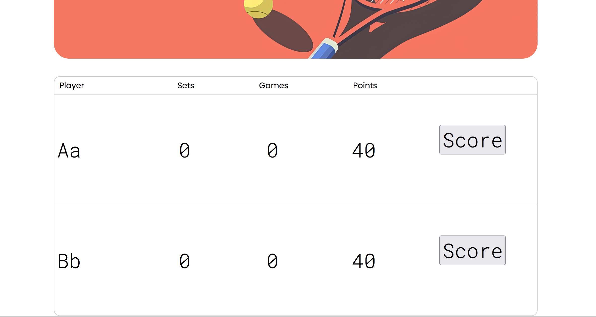
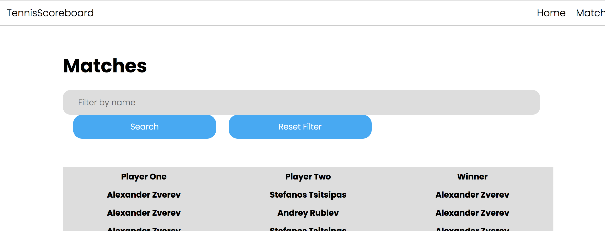
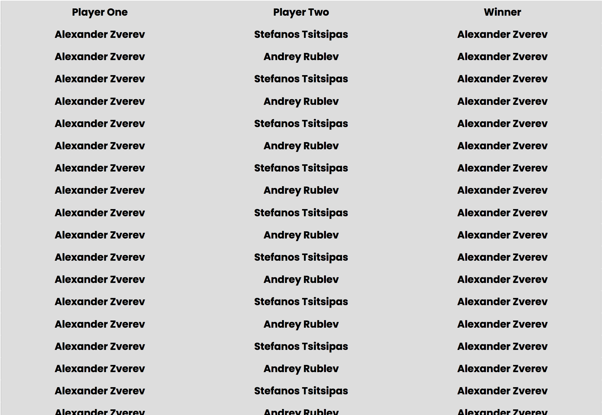
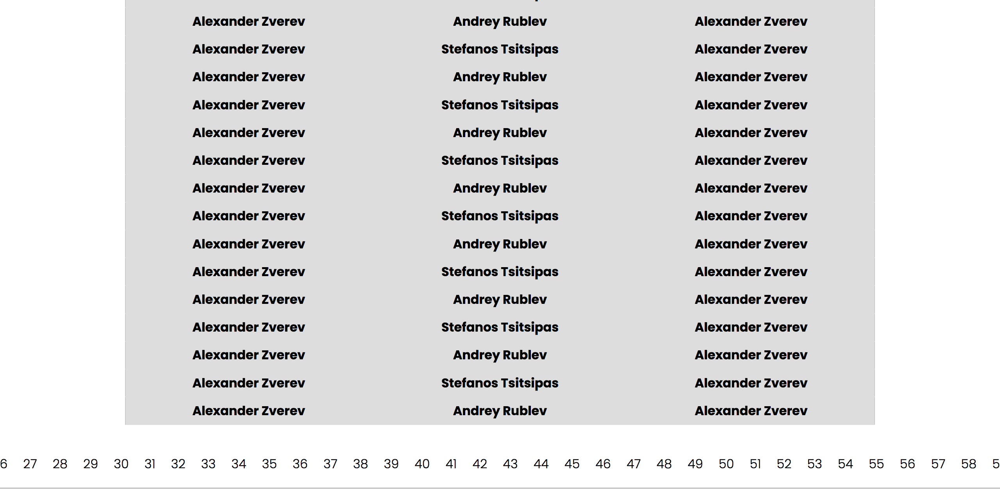
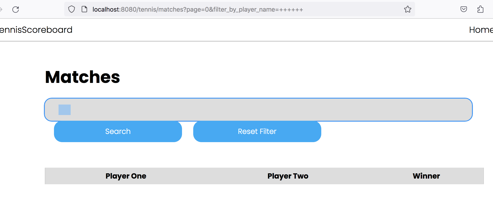

# Сводный отчёт по код-ревью проекта `tennis-scoreboard`

# Review на реализацию от [@almasdii](https://github.com/almasdii/tennis) проекта [Табло теннисного матча](https://zhukovsd.github.io/java-backend-learning-course/projects/tennis-scoreboard/)

> Ревью выполнено в формате fork-а репозитория и добавления комментариев 'In-Situ' и обучающих заметок в формате markdown.

К классам и файлам конфигурации добавлены подробные комментарии. 

Там же есть ссылки на файлы, объясняющие некоторые особо значимые темы. 

Сами файлы с заметками находятся в одном пакете с классами, к которым относится тема заметки.

```
В `TODO`-комментариях️ описаны критически важные замечания, а также места нарушения ТЗ.
```

```text
Знаком ❗️ помечены критически важные замечания, а также места нарушения ТЗ.
```

## Функциональный обзор

- На странице создания матча всегда отображается пример сообщения об ошибке.



- Неточное сообщение об ошибке 



Имена игроков начинаются с заглавных букв и не содержат пробелом, но не проходят валидацию.

- Неоправданно строгие ограничения: нельзя использовать пробел, дефис, апостроф и точку в имени игрока, хотя всё это может встречаться в реальном имени.

Из-за этого даже нельзя создать игрока с именем из тестовых примеров, которые добавляются в БД при старте приложения



- В режиме больше-меньше не отображается, у какого игрока преимущество



- Последний сыгранный матч отображается последним в списке на странице завершённых матчей — чтобы посмотреть его результат в таблице надо листать до последней страницы. Лучше, чтобы последний завершённый отображался первым в списке (на первой странице).

- Когда фильтр по имени не применён, можно не показывать кнопку сброса фильтра



- Завершённые матчи было бы удобнее просматривать, если бы они визуально отделялись друг от друга, например чертой. Сейчас визуально это просто три списка имён 



- ❗️В пагинации на странице завершённых матчей отображаются все страницы, что плохо выглядит при большом количестве страниц и делает недоступными страницы за пределами экрана.



Лучше сделать отображение текущей и +-2 страниц вокруг неё.

- При фильтрации по пустой строке сейчас не показывается ни один матч:



Вместо этого можно считать это за отсутствие фильтра и показывать все матчи. 

## Конфигурационные файлы

### pom.xml

Как и из кода, комментарии из файлов конфигурации стоит удалять перед коммитом
```xml
<!-- Как и из кода, комментарии из файлов конфигурации стоит удалять перед коммитом -->
```
***

Версии зависимостей (особенно повторяющиеся) лучше вынести в properties
```xml
<!-- Версии зависимостей (особенно повторяющиеся) лучше вынести в properties -->
```
***

Alpha и milestone версии программного обеспечения являются предварительными выпусками. Лучше использовать стабильные (GA - General Availability) версии зависимостей.
```xml
<!-- Alpha и milestone версии программного обеспечения являются предварительными выпусками.
Лучше использовать стабильные (GA - General Availability) версии зависимостей. -->
```
***

Используются разные версии junit
```xml
<!-- Используются разные версии junit -->
```
***

В этой версии зависимости обнаружена уязвимость
```xml
<!-- В этой версии зависимости обнаружена уязвимость -->
```
***

По умолчанию значение scope — compile, а должен быть здесь provided
```xml
<!-- По умолчанию значение scope — compile, а должен быть здесь provided -->
```
***

Стоит явно указать версию плагина
```xml
<!-- Стоит явно указать версию плагина -->
```
***

Лучше использовать LTS версию Java
```xml
<!-- Лучше использовать LTS версию Java -->
```
***

### hibernate.cfg.xml

Настройка дублируется
```xml
<!-- Настройка дублируется -->
```
***

### logback.xml

Как и из кода, комментарии из файлов конфигурации стоит удалять перед коммитом
```html
<!-- Как и из кода, комментарии из файлов конфигурации стоит удалять перед коммитом -->
```
***

## TableTennis.Exception

- Опечатка в названии пакета: 'Exception' —> 'exception'

### DataBaseException

Конструктор, который не используется можно удалить
```java
    // Конструктор, который не используется можно удалить
    public DataBaseException(String message){
        super(message);
    }
```
***

## TableTennis

### Main

В веб-приложении класс Main с методом public static void main(String[] args) не является точкой входа в приложение, а также не выполняет никакой полезной работы, поэтому его нужно удалить
```java
// В веб-приложении класс Main с методом public static void main(String[] args) не является точкой входа в приложение,
    // а также не выполняет никакой полезной работы, поэтому его нужно удалить
public class Main {
```
***

### Main2

В веб-приложении класс Main2 с методом public static void main(String[] args) не является точкой входа в приложение, а также не выполняет никакой полезной работы, поэтому его нужно удалить
```java
// В веб-приложении класс Main2 с методом public static void main(String[] args) не является точкой входа в приложение,
    // а также не выполняет никакой полезной работы, поэтому его нужно удалить
@Slf4j
public class Main2 {
```
***

## TableTennis.dao

### Dao

В этом проекте можно не вводить базовый интерфейс ради одного метода
```java
    // В этом проекте можно не вводить базовый интерфейс ради одного метода
```
***

Вместо K в качестве параметра типа больше подошла бы E (от Entity)
```java
    // Вместо K в качестве параметра типа больше подошла бы E (от Entity)
```
***

### MatchDao

Можно просто findAll
```java
    // Можно просто findAll
```
***

Метод DAO должен принимать уже готовые значения для смещения (offset — количество пропускаемых записей) и limit (максимальное количество записей на странице — в текущей реализации — pageSize), чтобы не заниматься их вычислениями самостоятельно
```java
    // TODO: Метод DAO должен принимать уже готовые значения для смещения (offset — количество пропускаемых записей)
        // и limit (максимальное количество записей на странице — в текущей реализации — pageSize),
        // чтобы не заниматься их вычислениями самостоятельно
    List<MatchEntity> findAllMatches(int pageNumber,int pageSize);
```
***

Более понятным было бы findAllByPlayerName
```java
    // Более понятным было бы findAllByPlayerName
```
***

Метод DAO должен принимать уже готовые значения для смещения (offset — количество пропускаемых записей) и limit (максимальное количество записей на странице — в текущей реализации — pageSize), чтобы не заниматься их вычислениями самостоятельно
```java
    // TODO: Метод DAO должен принимать уже готовые значения для смещения (offset — количество пропускаемых записей)
        // и limit (максимальное количество записей на странице — в текущей реализации — pageSize),
        // чтобы не заниматься их вычислениями самостоятельно
    List<MatchEntity> findAllMatchesLikeName(int pageNumber,int pageSize,String name);
```
***

Можно просто countAll
```java
    // Можно просто countAll
```
***

Больше подошло бы countByPlayerName
```java
    // Больше подошло бы countByPlayerName
```
***

## TableTennis.dao.hibernateImpl

### JOIN FETCH и LEFT JOIN FETCH в JPA/Hibernate

#### 1. Что такое JOIN FETCH?

`JOIN FETCH` – это специальная конструкция в JPQL (Java Persistence Query Language), которая позволяет загрузить связанные сущности (ассоциации) в одном запросе с основной сущностью, избегая так называемой проблемы N+1 запроса. Обычно, если у сущности есть ленивая (LAZY) ассоциация, при обращении к ней Hibernate выполняет отдельный SQL-запрос для каждой такой сущности. Использование `JOIN FETCH` заставляет Hibernate выполнить SQL JOIN (объединение) и сразу получить все необходимые данные, заполнив ассоциацию в объекте.

Синтаксис:

```postgres-sql
SELECT e FROM Entity e JOIN FETCH e.association
```

Здесь `association` – это поле сущности, помеченное аннотациями `@OneToMany`, `@ManyToOne` и т.п.

#### 2. JOIN FETCH (INNER JOIN FETCH)

По умолчанию `JOIN FETCH` эквивалентен **INNER JOIN** в SQL. Это означает, что в результат попадут только те записи основной сущности, для которых существует связанная запись (по условию соединения). Сами связанные сущности будут загружены и инициализированы.

**Пример:**

Допустим, есть сущности `Order` (заказ) и `OrderItem` (позиция заказа). У заказа может быть много позиций. Чтобы получить все заказы, у которых **есть хотя бы одна позиция**, и сразу загрузить эти позиции, используем:

```postgres-sql
SELECT o FROM Order o JOIN FETCH o.items
```

Такой запрос вернет только заказы с позициями. Если у заказа нет позиций, он не будет включён в результат.

#### 3. LEFT JOIN FETCH

`LEFT JOIN FETCH` соответствует **LEFT OUTER JOIN** в SQL. Он возвращает все записи основной сущности, даже если для них нет связанных записей. Для тех, у кого связь отсутствует, ассоциация будет заполнена пустой коллекцией (или `null` для одиночных связей), но сама основная сущность попадёт в результат.

**Пример:**
```jpql
SELECT o FROM Order o LEFT JOIN FETCH o.items
```
Этот запрос вернёт **все** заказы, включая те, у которых нет позиций. Для заказов без позиций поле `items` будет пустым списком (если тип коллекции) или `null` (если это одиночная связь).

#### 4. Основные отличия

| Характеристика           | JOIN FETCH (INNER)                     | LEFT JOIN FETCH                        |
|--------------------------|----------------------------------------|----------------------------------------|
| Тип SQL JOIN             | INNER JOIN                             | LEFT OUTER JOIN                        |
| Включение сущностей без связи | Не включаются                        | Включаются, ассоциация пустая/null     |
| Результат запроса        | Только сущности, имеющие связанные     | Все сущности основной таблицы          |
| Использование            | Когда нужны только те, у кого есть связь | Когда нужны все, но с загрузкой связи  |

### Принцип разделения ответственности (Separation of Concerns) в архитектуре MVC(S)

## Введение

Любое программное приложение со временем усложняется. Чтобы сохранить возможность развивать и поддерживать его, в разработке используют принцип **разделения ответственности (Separation of Concerns, SoC)**. Суть его такая: каждый модуль или слой системы должен отвечать за одну чётко определённую задачу. Это улучшает читаемость кода, упрощает тестирование, позволяет заменять отдельные части без влияния на остальные.

## Общая архитектура MVC(S)

MVC (Model-View-Controller) – архитектурный паттерн для разделения данных приложения и управляющей логики на три отдельных компонента: модель, представление и контроллер. В веб-приложениях его часто расширяют до **MVC(S)**, где отдельно выделяют слой **Service** (бизнес-логика).

- **View (Представление)** – то, что видит пользователь (JSP-страницы).
- **Controller (Контроллер)** – сервлеты, которые принимают HTTP-запросы, вызывают нужные сервисы и передают данные в представление.
- **Model (Модель)** – данные и логика их обработки. В текущем проекте модель состоит из нескольких подуровней:
    - **Domain Model (Доменная модель)** – объекты, отражающие бизнес-сущности и правила.
    - **Service (Сервис)** – слой, содержащий бизнес-логику и координирующий работу с данными.
    - **DAO (Data Access Object)** – объекты доступа к данным, работающие с JPA-сущностями.
    - **JPA-Entity** – сущности, привязанные к таблицам базы данных через JPA-аннотации.
    - **DTO (Data Transfer Object)** – объекты для передачи данных между слоями (например, между сервисом и контроллером).

Такое расслоение позволяет чётко разграничить зоны ответственности каждого компонента.

## Детальный разбор слоёв

### 1. JSP (View)

JSP отвечает только за **отображение данных**, полученных от контроллера, и за формирование HTML-форм для отправки данных на сервер. JSP не должна содержать бизнес-логики, обращений к базе данных или прямых вызовов сервисов. Все необходимые для рендеринга данные контроллер помещает в атрибуты запроса (или сессии).

### 2. Сервлеты (Controller)

Сервлет выступает в роли **контроллера** – точки входа для HTTP-запросов. Его обязанности:
- Прочитать параметры запроса.
- Вызвать соответствующий метод сервиса (передав при необходимости DTO или простые параметры).
- Обработать результат: поместить данные в атрибуты запроса/сессии.
- Выбрать представление (JSP) для ответа и выполнить перенаправление или forward.

Контроллер **не должен содержать** бизнес-логику и код доступа к данным. Всё это делегируется сервисам.

### 3. DTO (Data Transfer Object)

DTO – это простые объекты, которые служат только для **передачи данных** между слоями приложения. Они не содержат бизнес-логики и обычно имеют только поля, конструкторы и геттеры/сеттеры.

Зачем нужны DTO, если есть доменные модели и JPA-сущности? Причины:
- **Изоляция представления от модели данных.** JSP может использовать только те поля, которые действительно нужны на странице, и не видеть, например, методы доменных объектов.
- **Упрощение сериализации.** Если понадобится отдавать данные в формате JSON, DTO удобно преобразовывать в JSON без риска зацикливания (при связях между сущностями).
- **Безопасность.** Нельзя случайно передать на клиент пароль или внутренние флаги.

### 4. Сервисы (Service)

Сервисный слой содержит **бизнес-логику приложения**. Здесь выполняются:
- Проверки правильности данных (валидация, которая не может быть выполнена на уровне БД).
- Координация нескольких DAO (например, перевод денег со счёта на счёт).
- Вычисления, формирование отчётов, отправка уведомлений.
- Преобразование доменных объектов в DTO (и обратно).

Сервис ничего не знает о том, как данные будут отображаться (JSP, REST и т.д.) и откуда пришёл запрос. Он работает с доменными моделями и DAO.

### 5. Доменные модели (Domain Model)

Доменная модель представляет **бизнес-сущности** и правила. В простейшем случае это могут быть POJO-классы, похожие на JPA-сущности, но с дополнительными бизнес-методами. В идеале доменная модель не зависит от способа хранения (БД) и содержит поведение.

### 6. JPA-Entity

Это класс, помеченный аннотациями JPA (@Entity, @Table и т.д.), который **отображается на таблицу базы данных**. Его поля соответствуют колонкам. Он может содержать аннотации связей (@OneToMany, @ManyToOne).

### 7. DAO (Data Access Object)

Слой DAO отвечает исключительно за **доступ к данным**. Он использует JPA EntityManager для выполнения CRUD-операций и запросов. DAO не должен содержать бизнес-логику. В простейшем случае методы: findById, findAll, save, update, delete.

## Принципы взаимодействия слоёв

Чтобы разделение ответственности работало, нужно строго соблюдать правила взаимодействия между слоями. Вот основные принципы:

1. **Контроллер** общается только с **сервисом**. Он передаёт ему данные из запроса (возможно, упакованные в DTO) и получает от сервиса DTO или простые типы.
2. **Сервис** работает с **DAO** и **доменными моделями**. Он может преобразовывать доменные объекты в DTO и обратно, но не должен знать о существовании HTTP-сессии или JSP.
3. **DAO** работает только с **JPA-сущностями** и EntityManager. Он не содержит бизнес-логики.
4. **JSP** использует только те данные, которые передал контроллер (атрибуты запроса). Никаких обращений к сервисам или DAO из JSP быть не должно.
5. **DTO** используются для передачи данных между **сервисом и контроллером** (или контроллером и представлением). Они не должны содержать ссылок на EntityManager или зависеть от JPA.

Такая изоляция позволяет менять реализацию любого слоя без влияния на другие. Например, можно заменить JSP на другой движок представлений (например, Thymeleaf), заменив только контроллер и добавив новые шаблоны. Или заменить Hibernate на другую реализацию JPA, изменив только DAO.

## Преимущества разделения ответственности

Когда каждый класс выполняет строго свою функцию, это даёт ряд преимуществ:

- **Лёгкость поддержки и модификации**. Если нужно изменить способ отображения (например, добавить пагинацию), меняется только JSP и, возможно, контроллер. Бизнес-логика остаётся нетронутой.
- **Тестируемость**. Сервисы можно тестировать с мок-объектами DAO без запуска сервера. DAO можно тестировать с in-memory БД (например, H2).
- **Возможность замены технологий**. Если нужно заменить JSP на Freemarker, понадобится новый контроллер (или модификация существующего), но сервисы и DAO не меняются. Чтобы перейти с Hibernate на EclipseLink меняется только JPA-провайдер и, возможно, настройки – код DAO остаётся тем же (если используется стандартный JPA API).
- **Командная разработка**. Разные разработчики могут параллельно работать над представлением, бизнес-логикой и доступом к данным, если чётко определены интерфейсы взаимодействия.

## Заключение

Разделение ответственности – фундаментальный принцип, который стоит применять даже в небольших проектах, чтобы избежать "каши" из кода и облегчить дальнейшее развитие.

Такой подход готовит почву для перехода на более мощные фреймворки (например, Spring), которые предлагают готовые механизмы для реализации этих слоёв (например, Spring MVC, Spring Data, Spring Web Services). Но даже без фреймворков, при следовании принципам SoC, получается чистый, понятный и гибкий код.

Главная цель разделения ответственности – упростить жизнь разработчикам и обеспечить долгосрочную жизнеспособность приложения.

### HibernateMatchDaoImpl

Константы объявляются первыми (пишутся в самом верху) в классе.
```java
    // Константы объявляются первыми (пишутся в самом верху) в классе.
```
***

Для констант в этом классе достаточно видимости private.
```java
    // Для констант в этом классе достаточно видимости private.
```
***

Можно добавить суффикс '_QHL' или '_QUERY' к константам с текстом запросов.
```java
    // Можно добавить суффикс '_QHL' или '_QUERY' к константам с текстом запросов.
```
***

Где-то SELECT и FROM написаны на одной строке, а где-то на разных — лучше использовать один подход.
```java
    // Где-то SELECT и FROM написаны на одной строке, а где-то на разных — лучше использовать один подход.
```
***

В HQL запросах используется JOIN FETCH, что эквивалентно 'INNER JOIN' в SQL. `INNER JOIN` вернёт только те записи о матчах, у которых все связанные сущности (`player1`, `player2`) гарантированно существуют в базе. Если по какой-либо причине (например, ошибка при импорте или ручное вмешательство) в таблице `matches` окажется запись со значением `NULL` в колонке `player1`, то такой матч будет молчаливо исключён из выборки. `LEFT JOIN` является более безопасным подходом: - Он вернёт все матчи, даже если у них нарушена связь с игроком. - Это позволит приложению либо упасть с `NullPointerException` (что явно укажет на проблему с целостностью данных), либо корректно обработать такую ситуацию, если она допустима. "Падать громко и рано" часто лучше, чем молча скрывать проблемы. Стоит заменить `JOIN FETCH` на `LEFT JOIN FETCH` для обоих игроков и победителя для большей устойчивости запроса к потенциально некорректным данным. (см. файл "join-fetch-left-join-fetch.md" в этом же пакете)
```java
    // В HQL запросах используется JOIN FETCH, что эквивалентно 'INNER JOIN' в SQL.
        //
        // `INNER JOIN` вернёт только те записи о матчах, у которых все связанные сущности (`player1`, `player2`)
        // гарантированно существуют в базе. Если по какой-либо причине (например, ошибка при импорте или
        // ручное вмешательство) в таблице `matches` окажется запись со значением `NULL` в колонке `player1`,
        // то такой матч будет молчаливо исключён из выборки.
        //
        // `LEFT JOIN` является более безопасным подходом:
            //  - Он вернёт все матчи, даже если у них нарушена связь с игроком.
            //  - Это позволит приложению либо упасть с `NullPointerException` (что явно укажет на проблему
                //  с целостностью данных), либо корректно обработать такую ситуацию, если она допустима.
                //  "Падать громко и рано" часто лучше, чем молча скрывать проблемы.
        //
        // Стоит заменить `JOIN FETCH` на `LEFT JOIN FETCH` для обоих игроков и победителя
        // для большей устойчивости запроса к потенциально некорректным данным.
        //
        // (см. файл "join-fetch-left-join-fetch.md" в этом же пакете)
```
***

TODO: В методах отсутствует явная сортировка результатов. Запросы HQL не содержат `ORDER BY`, поэтому порядок возвращаемых записей зависит от реализации JPA (обычно по первичному ключу в порядке возрастания). Это приводит к тому, что самые новые матчи отображаются в конце списка. Пользователь, заходящий на страницу завершённых матчей, ожидает увидеть сначала последние завершённые матчи. В текущей реализации ему приходится пролистывать пагинацию до конца, чтобы найти свежие результаты. Это ухудшает пользовательский опыт и делает интерфейс неинтуитивным. При большом количестве матчей добираться до новых данных будет крайне неудобно. Стоит добавить в HQL-запрос сортировку по убыванию идентификатора матча, так как это естественный способ упорядочить матчи от новых к старым.
```java
    // TODO: В методах отсутствует явная сортировка результатов. Запросы HQL не содержат `ORDER BY`,
        // поэтому порядок возвращаемых записей зависит от реализации JPA (обычно по первичному ключу в порядке возрастания).
        // Это приводит к тому, что самые новые матчи отображаются в конце списка.
        // Пользователь, заходящий на страницу завершённых матчей, ожидает увидеть сначала последние завершённые матчи.
        // В текущей реализации ему приходится пролистывать пагинацию до конца, чтобы найти свежие результаты.
        // Это ухудшает пользовательский опыт и делает интерфейс неинтуитивным.
        // При большом количестве матчей добираться до новых данных будет крайне неудобно.
        // Стоит добавить в HQL-запрос сортировку по убыванию идентификатора матча, так как это естественный способ упорядочить матчи от новых к старым.
```
***

Из HQL-запросов можно убрать проверку совпадения по имени победителя — так как он всегда является одним из игроков, достаточно проверять совпадения только по их именам.
```java
    // Из HQL-запросов можно убрать проверку совпадения по имени победителя —
        // так как он всегда является одним из игроков, достаточно проверять совпадения только по их именам.
```
***

Название параметра "name" тоже лучше вынести в именованную константу
```java
    // Название параметра "name" тоже лучше вынести в именованную константу
```
***

TODO: Тело каждого метода стоит обернуть в try-catch и отлавливать HibernateException или PersistenceException. Слой DAO должен перехватывать специфичные для технологии исключения (например, `HibernateException`) и оборачивать их в свои, более общие исключения слоя доступа к данным (например, `DataBaseException`). Это скрывает детали реализации от верхних слоёв и делает их независимыми от деталей реализации DAO.
```java
    // TODO: Тело каждого метода стоит обернуть в try-catch и отлавливать HibernateException или PersistenceException.
        // Слой DAO должен перехватывать специфичные для технологии исключения (например, `HibernateException`)
        // и оборачивать их в свои, более общие исключения слоя доступа к данным (например, `DataBaseException`).
        // Это скрывает детали реализации от верхних слоёв и делает их независимыми от деталей реализации DAO.
```
***

Заниматься вычислением смещения должен слой сервисов. (см. файл "separation-of-concerns-principle.md" в этом же пакете)
```java
        // Заниматься вычислением смещения должен слой сервисов. (см. файл "separation-of-concerns-principle.md" в этом же пакете)
        query.setFirstResult(pageNumber * pageSize);
```
***

Логировать параметры следует там, где принимается решение и где есть полный контекст. В данном случае, решение о том, какую страницу запросить и с каким размером, принимается на уровне сервиса. А также класс DAO не должен знать о таких понятиях как страницы или пагинация. Ему следует передавать уже готовые параметры offset (смещение) и limit (лимит). Поэтому логировать эти параметры лучше в сервисном слое.
```java
        // Логировать параметры следует там, где принимается решение и где есть полный контекст.
            // В данном случае, решение о том, какую страницу запросить и с каким размером, принимается на уровне сервиса.
            // А также класс DAO не должен знать о таких понятиях как страницы или пагинация.
            // Ему следует передавать уже готовые параметры offset (смещение) и limit (лимит).
            // Поэтому логировать эти параметры лучше в сервисном слое.
        log.debug("page size : {}",pageSize);
        log.debug("first result : {}",pageNumber * pageSize);
```
***

Можно записать в таком стиле:
```java
        // Можно записать в таком стиле:
        /*
        currentSession.createQuery(FIND_ALL_MATCHES_BY_NAME, MatchEntity.class)
                .setParameter("name", "%" + playerName + "%")
                .setFirstResult(offset)
                .setMaxResults(pageSize)
                .getResultList();
         */
```
***

Заниматься вычислением смещения должен слой сервисов. (см. файл "separation-of-concerns-principle.md" в этом же пакете)
```java
        // Заниматься вычислением смещения должен слой сервисов. (см. файл "separation-of-concerns-principle.md" в этом же пакете)
        query.setFirstResult(pageNumber * pageSize);
```
***

### HibernatePlayerDaoImpl

Текст HQL запроса удобнее читать, когда он логично разбит на строки, даже если он короткий. Для визуального разделения запросов на строки лучше использовать текстовые блоки
```java
    // Текст HQL запроса удобнее читать, когда он логично разбит на строки, даже если он короткий.
        // Для визуального разделения запросов на строки лучше использовать текстовые блоки
```
***

TODO: Тело каждого метода стоит обернуть в try-catch и отлавливать HibernateException или PersistenceException. Слой DAO должен перехватывать специфичные для технологии исключения (например, `HibernateException`) и оборачивать их в свои, более общие исключения слоя доступа к данным (например, `DataBaseException`). Это скрывает детали реализации от верхних слоёв и делает их независимыми от деталей реализации DAO.
```java
    // TODO: Тело каждого метода стоит обернуть в try-catch и отлавливать HibernateException или PersistenceException.
        // Слой DAO должен перехватывать специфичные для технологии исключения (например, `HibernateException`)
        // и оборачивать их в свои, более общие исключения слоя доступа к данным (например, `DataBaseException`).
        // Это скрывает детали реализации от верхних слоёв и делает их независимыми от деталей реализации DAO.
```
***

Константы объявляются первыми (пишутся в самом верху) в классе. Достаточно видимости private. Можно добавить суффикс '_QHL' или '_QUERY'
```java
    // Константы объявляются первыми (пишутся в самом верху) в классе.
    // Достаточно видимости private
    // Можно добавить суффикс '_QHL' или '_QUERY'
```
***

Можно использовать .uniqueResultOptional()
```java
                    .uniqueResult()); // Можно использовать .uniqueResultOptional()
```
***

## TableTennis.dto

### MatchScoreDto

Числительные в полях для счёта тоже можно писать словами (а не цифрами)
```java
        int point1,
```
***

### PaginationData

1. Опечатка: numerOfPages —> numberOfPages 2. Возможно более однозначным было бы название totalPages
```java
        int numerOfPages, 
```
***

### PaginationDto

Возможно более однозначным было бы название totalPages
```java
public record PaginationDto(List<MatchResponse> currentPageMatches, int numberOfPages /* Возможно более однозначным было бы название totalPages */, int currentPage, int pageSize) {
```
***

## TableTennis.entity

### Использование зарезервированных слов в качестве названий в БД

Использование зарезервированного слова (например, `USER`, `ORDER`, `GROUP`) в качестве названия таблицы в базе данных — это плохая практика, которая может привести к ряду проблем.

Вот основные из них:

### 1. Синтаксические ошибки

Это самая главная и частая проблема. SQL-парсер видит зарезервированное слово и ожидает определённой синтаксической конструкции, а не названия таблицы.

**Пример:**
При попытке получить все записи из таблицы с названием `ORDER`.
```sql
SELECT * FROM ORDER;
```
этот запрос, скорее всего, вызовет ошибку, потому что `ORDER` — это ключевое слово для `ORDER BY` (сортировка). Парсер будет ожидать после него `BY` и не поймёт, что `ORDER` — это название таблицы.

### 2. Необходимость экранирования (Quoting)

Чтобы обойти синтаксические ошибки, придётся постоянно заключать название таблицы в специальные кавычки, которые зависят от конкретной СУБД:

* **MySQL / MariaDB:** обратные кавычки (`` ` ``)
    ```sql
    SELECT * FROM `ORDER`;
    ```
* **PostgreSQL / Стандарт SQL:** двойные кавычки (`" "`)
    ```sql
    SELECT * FROM "ORDER";
    ```
* **SQL Server:** квадратные скобки (`[ ]`)
    ```sql
    SELECT * FROM [ORDER];
    ```

### 3. Снижение читаемости и усложнение кода

Из-за необходимости постоянного экранирования код становится менее читаемым. Разработчики могут легко забыть поставить кавычки, что приведёт к ошибкам, на поиск которых уйдёт время.

### 4. Проблемы с ORM и другими инструментами

Инструменты, которые автоматически генерируют SQL-запросы (например, Hibernate, JPA, SQLAlchemy и другие ORM), а также различные GUI-клиенты и утилиты для миграции, могут не справиться с такими названиями. Они могут не знать, что `ORDER` нужно экранировать, и будут генерировать нерабочий SQL-код. Это потребует дополнительной конфигурации или ручного вмешательства.

### 5. Потеря переносимости

Ключевые слова могут отличаться в разных СУБД. Слово, которое не зарезервировано в одной системе, может быть зарезервировано в другой. Если команда сменит СУБД, проект с такими названиями таблиц потребует значительной доработки.

---

**Лучшая практика:**

**Никогда не использовать зарезервированные слова для названий таблиц, столбцов и других объектов в БД.**

Всегда проверять список зарезервированных слов для основных СУБД. Чтобы избежать случайных совпадений, можно придерживаться соглашений об именовании, например:
* Использовать префиксы: `tbl_order`.
* Использовать множественное число (если слово во множественном числе не зарезервировано): `orders` (слово `orders` не зарезервировано).
* Добавлять суффиксы: `order_data`.

### Использование `@ToString` (Lombok) и `@Entity` (JPA) в одном классе

При совместном использовании `@ToString` (Lombok) и `@Entity` (JPA) необходимо соблюдать определенные правила, чтобы избежать распространенных проблем с JPA и Hibernate.

Основная проблема заключается в том, что `@ToString` по умолчанию включает все поля класса в сгенерированный метод `toString()`. Это может привести к следующим трудностям при работе с JPA-сущностями:

- StackOverflowError: если сущности имеют двунаправленные связи (например, Parent ссылается на Child, а Child на Parent), вызов `toString()` на одном объекте приведет к бесконечной рекурсии вызовов `toString()` между связанными объектами, что быстро исчерпает стек вызовов.
- Проблема N+1 запросов и нежелательная загрузка ленивых коллекций (Lazy Loading Issues): если `@ToString` пытается получить доступ к полям с ленивой загрузкой (`FetchType.LAZY`), которые ещё не были загружены из базы данных в текущей сессии (например, при вызове `toString()` вне транзакции), это приведет к ошибке LazyInitializationException.

Чтобы безопасно использовать `@ToString` с JPA-сущностями, необходимо исключить поля отношений из генерации `toString()`:

с помощью аннотации над полем
```java
@ToString.Exclude
```

или в аннотации над классом (старый подход)
```java
@ToString(exclude = "childEntity")
```

или использовать над классом
```java
@ToString(onlyExplicitlyIncluded = true)
```
и явно указывать нужные поля через аннотацию надо полем
```java
@ToString.Include
```

### BaseEntity

Если @ToString не используется в проекте, его можно не переопределять.
```java
@ToString 
```
***

Если equals и hashCode не используются в проекте, их можно не переопределять.
```java
@EqualsAndHashCode 
```
***

Создавать базовый класс ради одного общего поля — избыточно
```java
public class BaseEntity<K> {
```
***

### MatchEntity

"Matches" является зарезервированным словом в некоторых СУБД. Здесь проблем не будет, но лучше не выбирать такие названия. (см. файл "sql-keywords.md" в этом же пакете)
```java
@Table(name = "matches") 
```
***

Стоит добавить проверки, что игроки разные и победитель один из игроков. Например, через аннотацию org.hibernate.annotations.Check над классом.
```java
public class MatchEntity extends BaseEntity<Long>{
```
***

Можно назвать просто Match (контекст того, что это JPA Entity понятен из названия пакета)
```java
public class MatchEntity extends BaseEntity<Long>{
```
***

Если equals и hashCode не используются в проекте, их можно не переопределять.
```java
    @Override
    public boolean equals(Object o) {
```
***

Если @ToString не используется в проекте, его можно не переопределять.
```java
    @Override
    public String toString() {
```
***

Колонки игроков и победителя в `@JoinColumn` названы `player1`, `player2`, `winner`. Для колонок, хранящих внешний ключ, уместно добавлять суффикс `_id`, чтобы было очевидно, что в них хранится идентификатор, а не какая-то другая информация.
```java
    @JoinColumn(name = "player1") 
```
***

Поля игроков можно расположить в более логичном порядке: firstPlayer —> secondPlayer —> winner
```java
    private Player firstPlayer;
```
***

Для обязательных полей стоит добавить `optional = false` в `@ManyToOne` или `nullable = false` в `@JoinColumn` (можно добавить оба параметра). Целостность данных должна обеспечиваться на всех уровнях: в приложении (валидация) и в БД (constraints). Отсутствие ограничений в БД означает, что данные могут быть испорчены из-за ошибок в приложении или при прямом доступе к БД. А также можно добавить атрибут `updatable = false`. Это атрибут запрещает изменять колонку после её первоначальной вставки. Игроки матча и победитель не должны меняться, поэтому эти колонки можно защитить от обновлений.
```java
    @ManyToOne(fetch = FetchType.LAZY) 
```
***

Стоит добавить optional = false
```java
    @ManyToOne(fetch = FetchType.LAZY) 
```
***

Можно добавить nullable = false и updatable = false
```java
    @JoinColumn(name = "player1") 
```
***

Стоит добавить optional = false
```java
    @ManyToOne(fetch = FetchType.LAZY) 
```
***

Можно добавить nullable = false и updatable = false
```java
    @JoinColumn(name = "winner") 
```
***

Стоит добавить optional = false
```java
    @ManyToOne(fetch = FetchType.LAZY) 
```
***

Можно добавить nullable = false и updatable = false
```java
    @JoinColumn(name = "player2") 
```
***

При такой реализации equals все несохранённые матчи (которым БД ещё не присвоила ID) будут считаться одинаковыми.
```java
        return that.getId() != null && that.getId().equals(this.getId());
```
***

### Player

Если equals и hashCode не используются в проекте, их можно не переопределять.
```java
@EqualsAndHashCode(of = {"name"}, callSuper = false) 
```
***

Использование @ToString с @Entity может создавать проблемы (см. файл "tostring-entity.md" в этом же пакете), поэтому если он не используется в проекте, его можно не переопределять.
```java
@ToString 
```
***

можно задать индекс через аннотацию, чтобы у него было понятное имя — @Table(name = "players", indexes = @Index(...))
```java
@Table(name = "players") 
```
***

## TableTennis.filter

### ExceptionHandlerFilter

Можно подобрать более информативные сообщения для логирования, а также для возврата клиенту.
```java
public class ExceptionHandlerFilter implements Filter {
```
***

Вместо захардкоженных чисел в качестве кодов ответа можно использовать готовые константы из HttpServletResponse
```java
public class ExceptionHandlerFilter implements Filter {
```
***

Стоит подумать, как избавиться от большого количества дублирующихся частей в методе doFilter
```java
public class ExceptionHandlerFilter implements Filter {
```
***

Метод init можно не переопределять только для того, чтобы вызвать в нём метод родительского класса.
```java
    @Override
    public void init(FilterConfig filterConfig) throws ServletException {
```
***

Можно наследоваться от HttpFilter и переопределять метод 'void doFilter(HttpServletRequest req, HttpServletResponse res, FilterChain chain)' с уже приведёнными HttpServletRequest и HttpServletResponse
```java
        HttpServletRequest httpServletRequest = (HttpServletRequest) request;
        HttpServletResponse httpServletResponse = (HttpServletResponse) response;
```
***

Метод destroy можно не переопределять только для того, чтобы вызвать в нём метод родительского класса.
```java
    @Override
    public void destroy() {
```
***

## TableTennis.listener

## Принцип Единого источника истины (Single Source of Truth, SSOT)

Принцип Single Source of Truth (SSOT), или "Единый источник истины", в контексте программирования и управления данными означает архитектурный подход, при котором все данные о конкретной сущности или состоянии системы хранятся и управляются в одном единственном, авторитетном месте.

Суть принципа заключается в том, чтобы избежать дублирования информации и обеспечить ее согласованность. Если данные существуют в нескольких местах, всегда есть риск их расхождения, что приводит к ошибкам, путанице и неверным решениям.

#### Преимущества:

- Согласованность данных: невозможно иметь противоречивое состояние.
- Упрощение отладки и поддержки: данные берутся и изменяются только в одном месте.
- Упрощение тестирования: легче тестировать, так как состояние определяется одним источником.
- Повышение надежности: уменьшает количество ошибок и повышает уверенность в точности информации.

#### Возможные недостатки:
- Производительность: постоянное вычисление может быть дороже, чем хранение поля.
- Сложность вычислений: иногда вычисление сложное.

Следование принципу SSOT делает код более предсказуемым, надёжным и понятным.

### AppListener

Отсутствует явный модификатор доступа
```java
    SessionFactory sessionFactory;
```
***

Добавляется только Player, но не MatchEntity. Это нарушает принцип единого источника истины и может сбить с толку. (см. файл "ssot-principle.md" в этом же пакете) Оба класса сущностей уже обрабатываются в hibernate.cfg.xml, поэтому нет необходимости дублировать их добавление здесь.
```java
        configuration.addAnnotatedClass(Player.class);
```
***

Для помещения объектов в контекст можно использовать "естественные константы" — ClassName.class.getSimpleName() или ClassName.class.getName()
```java
        sce.getServletContext().setAttribute("OngoingMatchesService", ongoingMatchesService);
```
***

Стоит проверить, что sessionFactory != null
```java
        sessionFactory.close();
```
***

---

## TableTennis.model

## "Типы моделей" в веб-приложении

| Тип | Назначение | Контекст |
|---|---|--- |
| Entity (Сущность) | Объекты, соответствующие таблицам базы данных, представляют данные в том виде, в котором они хранятся в базе данных| Уровень персистентности (JPA/Hibernate) |
| Domain Model (Доменная модель) | Программные абстракции, представляют бизнес-логику, правила и поведение предметной области| Бизнес-уровень приложения |
| DTO (Data Transfer Object) | Объекты, используемые для передачи данных между различными слоями приложения| Уровень представления, API |

### Game

Методы класса нарушают принцип разделения команд и запросов (Command-Query Separation). Который гласит, что метод должен либо изменять состояние (команда), либо возвращать данные (запрос), но не делать и то, и другое. Смешение этих обязанностей усложняет код, его тестирование и понимание.
```java
    private Point firstPlayerPoint = Point.LOVE;
```
***

Можно назвать isFinished
```java
    private boolean isGameEnded;
```
***

Метод нарушает принцип разделения команд и запросов (Command-Query Separation).
```java
    protected boolean pointWonBy(PlayerNumber playerNumber){
```
***

Более подходящим было бы isFirstPlayerWon
```java
        boolean isFirstPlayer = playerNumber == PlayerNumber.FIRST_PLAYER;
```
***

Неинфомативное название метода. По сигнатуре метода должно быть понятно, что он делает.
```java
    private void nextPoint(PlayerNumber playerNumber){
```
***

Неинфомативное название метода. По сигнатуре метода должно быть понятно, что он делает. Метод нарушает принцип разделения команд и запросов (Command-Query Separation).
```java
    private boolean advantageCase(PlayerNumber playerNumber){
```
***

### Match

Класс хранит ссылки на JPA-сущности (`Player`). Использование объектов JPA Entity в доменной логике создаёт прямую зависимость доменного слоя от слоя персистентности (долговременного хранения данных) и смешивает слои приложения, что нарушает чистоту архитектуры. Это может привести к проблемам с ленивой загрузкой (`LazyInitializationException`) или к неожиданным изменениям в базе данных, если состояние `Player` будет изменено в ходе бизнес-логики. Доменные модели должны оперировать другими доменными моделями, а не сущностями, привязанными к базе данных. (см. файл "model-types.md" в этом же пакете)
```java
    @Getter private final Player firstPlayer;
```
***

Методы класса нарушают принцип разделения команд и запросов (Command-Query Separation). Который гласит, что метод должен либо изменять состояние (команда), либо возвращать данные (запрос), но не делать и то, и другое. Смешение этих обязанностей усложняет код, его тестирование и понимание.
```java
    public boolean pointWonBy(Player player){
```
***

Тела блоков if-else всегда нужно оборачивать в {}
```java
        if(playerNumber == PlayerNumber.FIRST_PLAYER) firstPlayerSets++;
```
***

В java принято называть методы глаголами: getFirstPlayerTieBreakScore
```java
    public int firstPlayerTieBreakScore(){
```
***

В java принято называть методы глаголами: getSecondPlayerTieBreakScore
```java
    public int secondPlayerTieBreakScore(){
```
***

### PlayerNumber

Значение поля value нигде не используется в проекте, поэтому его можно удалить.
```java
    private final int value;
```
***

Можно использовать @RequiredArgsConstructor
```java
    PlayerNumber(int value){
```
***

Не нужно переопределять метод только чтобы вызвать в нём метод родительского класса.
```java
    public String toString() {
```
***

### Point

Можно использовать @RequiredArgsConstructor
```java
    Point(int score) {
```
***

Лучше использовать информативные сообщения в исключениях.
```java
            case FORTY -> throw new IllegalArgumentException("asdfgh");
```
***

### TennisSet

Для констант в этом классе достаточно видимости private.
```java
    public static final int WIN_SCORE = 6;
```
***

Методы класса нарушают принцип разделения команд и запросов (Command-Query Separation). Который гласит, что метод должен либо изменять состояние (команда), либо возвращать данные (запрос), но не делать и то, и другое. Смешение этих обязанностей усложняет код, его тестирование и понимание.
```java
    protected boolean pointWonBy(PlayerNumber playerNumber){
```
***

Класс содержит поле для тай-брейка даже если в матче не будет сыграно ни одного тай-брейка.
```java
    private TieBreak tieBreak;
```
***

Неинфомативное название метода. По сигнатуре метода должно быть понятно, что он делает.
```java
    private void nextGame(PlayerNumber playerNumber){
```
***

Неинфомативное название метода. По сигнатуре метода должно быть понятно, что он делает. Метод нарушает принцип разделения команд и запросов (Command-Query Separation).
```java
    private boolean tieBreakCase(PlayerNumber playerNumber){
```
***

Этот метод может быть private
```java
    protected boolean isSetFinished(){
```
***

Тело блока if всегда нужно оборачивать в {}
```java
        if (firstPlayerGames == TAI_BREAK_WIN_SCORE || secondPlayerGames == TAI_BREAK_WIN_SCORE) return true;
```
***

В java принято называть методы глаголами: getFirstPlayerTieBreakScore
```java
    public int firstPlayerTieBreakScore(){
```
***

В java принято называть методы глаголами: getSecondPlayerTieBreakScore
```java
    public int secondPlayerTieBreakScore(){
```
***

### TieBreak

Для констант в этом классе достаточно видимости private.
```java
    public static final int WIN_SCORE = 7;
```
***

Все магические числа тоже стоит выносить в именованные константы. Именованная константа делает код более семантически понятным.
```java
        return (firstPlayerScore >= WIN_SCORE || secondPlayerScore >= WIN_SCORE) && Math.abs(firstPlayerScore - secondPlayerScore) >= 2;
```
***

Метод класса нарушает принцип разделения команд и запросов (Command-Query Separation). Который гласит, что метод должен либо изменять состояние (команда), либо возвращать данные (запрос), но не делать и то, и другое. Смешение этих обязанностей усложняет код, его тестирование и понимание.
```java
    protected boolean pointWonBy(PlayerNumber playerNumber){
```
***

## TableTennis.service

## service

- ❗️В пакете отсутствуют интерфейсы для сервисных классов. Все классы являются конкретными реализациями, от которых напрямую зависят другие компоненты приложения (например, сервлеты).

Почему это проблема:

  - Нарушение Принципа инверсии зависимостей (Dependency Inversion Principle): Принцип гласит, что модули верхних уровней не должны зависеть от модулей нижних уровней, а также они должны зависеть от абстракций. В данном случае вышестоящие модули (сервлеты) напрямую зависят от конкретных реализаций сервисов, что делает систему жёстко связанной и хрупкой.

  - Низкая тестируемость: Невозможно провести полноценное модульное тестирование компонентов, которые зависят от этих сервисов. Например, чтобы протестировать сервлет, использующий `FinishedMatchesPersistenceService`, необходимо создавать полный экземпляр этого сервиса со всеми его реальными зависимостями (DAO и др), что превращает модульный тест в сложный интеграционный.

  - Низкая гибкость и невозможность расширения: Если потребуется создать альтернативную реализацию какого-либо сервиса, это потребует изменения кода во всех местах, где использовалась оригинальная реализация.

  - В классе-реализации публичные методы смешиваются с его внутренними или вспомогательными методами. Интерфейс же служит чётким, явным контрактом, который показывает, что сервис предоставляет внешнему миру, скрывая детали его внутренней работы.

Для каждого класса в этом пакете стоит создать интерфейс, который будет определять его публичный контракт, и изменить все зависимые классы так, чтобы они использовали этот интерфейс.

### Принцип наименьшего удивления (Principle of Least Astonishment, POLA)

**Система должна вести себя так, как от неё ожидает большинство пользователей (разработчиков), и не должна вызывать удивление или замешательство.**

Это означает, что API, класс, метод или даже однострочное выражение должны быть **интуитивно понятными** и **предсказуемыми** для другого разработчика.

### Ключевые аспекты принципа

- Следование общепринятым соглашениям и идиомам: Имена методов и классов должны точно отражать их поведение. Геттеры начинаются с `get`/`is`, сеттеры — с `set`. Классы — `CamelCase`, переменные — `camelCase`, константы — `UPPER_SNAKE_CASE`.

- Предсказуемость поведения: Поведение методов должно быть интуитивно понятным и соответствовать тому, что подразумевает их имя и сигнатура.

- Соблюдение контрактов методов:

  - Если метод называется `getSomething()`, он должен возвращать что-то, а не изменять состояние.

  - Если метод называется `calculateSomething(params)`, он должен вычислять и возвращать результат, а не изменять переданные параметры.

- Следование единому стилю: Если в одном методе используется порядок параметров `(source, destination)`, то его следует придерживаться во всех похожих методах. Нельзя в другом методе делать `(destination, source)`.

- Согласованные возвращаемые значения: Если семейство методов возвращает `-1` при ошибке, не стоит в одном из них возвращать `0` или бросать исключение без веской причины.

Принцип наименьшего удивления в программировании — это о снижении когнитивной нагрузки на других разработчиков. Это создание кода, который ведёт себя так, как от него ждут, потому что он следует установленным правилам, здравому смыслу и согласованности. Следование этому принципу напрямую ведёт к созданию более чистого, поддерживаемого и надёжного кода.

### Принцип разделения ответственности (Separation of Concerns) в архитектуре MVC(S)

## Введение

Любое программное приложение со временем усложняется. Чтобы сохранить возможность развивать и поддерживать его, в разработке используют принцип **разделения ответственности (Separation of Concerns, SoC)**. Суть его такая: каждый модуль или слой системы должен отвечать за одну чётко определённую задачу. Это улучшает читаемость кода, упрощает тестирование, позволяет заменять отдельные части без влияния на остальные.

## Общая архитектура MVC(S)

MVC (Model-View-Controller) – архитектурный паттерн для разделения данных приложения и управляющей логики на три отдельных компонента: модель, представление и контроллер. В веб-приложениях его часто расширяют до **MVC(S)**, где отдельно выделяют слой **Service** (бизнес-логика).

- **View (Представление)** – то, что видит пользователь (JSP-страницы).
- **Controller (Контроллер)** – сервлеты, которые принимают HTTP-запросы, вызывают нужные сервисы и передают данные в представление.
- **Model (Модель)** – данные и логика их обработки. В текущем проекте модель состоит из нескольких подуровней:
    - **Domain Model (Доменная модель)** – объекты, отражающие бизнес-сущности и правила.
    - **Service (Сервис)** – слой, содержащий бизнес-логику и координирующий работу с данными.
    - **DAO (Data Access Object)** – объекты доступа к данным, работающие с JPA-сущностями.
    - **JPA-Entity** – сущности, привязанные к таблицам базы данных через JPA-аннотации.
    - **DTO (Data Transfer Object)** – объекты для передачи данных между слоями (например, между сервисом и контроллером).

Такое расслоение позволяет чётко разграничить зоны ответственности каждого компонента.

## Детальный разбор слоёв

### 1. JSP (View)

JSP отвечает только за **отображение данных**, полученных от контроллера, и за формирование HTML-форм для отправки данных на сервер. JSP не должна содержать бизнес-логики, обращений к базе данных или прямых вызовов сервисов. Все необходимые для рендеринга данные контроллер помещает в атрибуты запроса (или сессии).

### 2. Сервлеты (Controller)

Сервлет выступает в роли **контроллера** – точки входа для HTTP-запросов. Его обязанности:
- Прочитать параметры запроса.
- Вызвать соответствующий метод сервиса (передав при необходимости DTO или простые параметры).
- Обработать результат: поместить данные в атрибуты запроса/сессии.
- Выбрать представление (JSP) для ответа и выполнить перенаправление или forward.

Контроллер **не должен содержать** бизнес-логику и код доступа к данным. Всё это делегируется сервисам.

### 3. DTO (Data Transfer Object)

DTO – это простые объекты, которые служат только для **передачи данных** между слоями приложения. Они не содержат бизнес-логики и обычно имеют только поля, конструкторы и геттеры/сеттеры.

Зачем нужны DTO, если есть доменные модели и JPA-сущности? Причины:
- **Изоляция представления от модели данных.** JSP может использовать только те поля, которые действительно нужны на странице, и не видеть, например, методы доменных объектов.
- **Упрощение сериализации.** Если понадобится отдавать данные в формате JSON, DTO удобно преобразовывать в JSON без риска зацикливания (при связях между сущностями).
- **Безопасность.** Нельзя случайно передать на клиент пароль или внутренние флаги.

### 4. Сервисы (Service)

Сервисный слой содержит **бизнес-логику приложения**. Здесь выполняются:
- Проверки правильности данных (валидация, которая не может быть выполнена на уровне БД).
- Координация нескольких DAO (например, перевод денег со счёта на счёт).
- Вычисления, формирование отчётов, отправка уведомлений.
- Преобразование доменных объектов в DTO (и обратно).

Сервис ничего не знает о том, как данные будут отображаться (JSP, REST и т.д.) и откуда пришёл запрос. Он работает с доменными моделями и DAO.

### 5. Доменные модели (Domain Model)

Доменная модель представляет **бизнес-сущности** и правила. В простейшем случае это могут быть POJO-классы, похожие на JPA-сущности, но с дополнительными бизнес-методами. В идеале доменная модель не зависит от способа хранения (БД) и содержит поведение.

### 6. JPA-Entity

Это класс, помеченный аннотациями JPA (@Entity, @Table и т.д.), который **отображается на таблицу базы данных**. Его поля соответствуют колонкам. Он может содержать аннотации связей (@OneToMany, @ManyToOne).

### 7. DAO (Data Access Object)

Слой DAO отвечает исключительно за **доступ к данным**. Он использует JPA EntityManager для выполнения CRUD-операций и запросов. DAO не должен содержать бизнес-логику. В простейшем случае методы: findById, findAll, save, update, delete.

## Принципы взаимодействия слоёв

Чтобы разделение ответственности работало, нужно строго соблюдать правила взаимодействия между слоями. Вот основные принципы:

1. **Контроллер** общается только с **сервисом**. Он передаёт ему данные из запроса (возможно, упакованные в DTO) и получает от сервиса DTO или простые типы.
2. **Сервис** работает с **DAO** и **доменными моделями**. Он может преобразовывать доменные объекты в DTO и обратно, но не должен знать о существовании HTTP-сессии или JSP.
3. **DAO** работает только с **JPA-сущностями** и EntityManager. Он не содержит бизнес-логики.
4. **JSP** использует только те данные, которые передал контроллер (атрибуты запроса). Никаких обращений к сервисам или DAO из JSP быть не должно.
5. **DTO** используются для передачи данных между **сервисом и контроллером** (или контроллером и представлением). Они не должны содержать ссылок на EntityManager или зависеть от JPA.

Такая изоляция позволяет менять реализацию любого слоя без влияния на другие. Например, можно заменить JSP на другой движок представлений (например, Thymeleaf), заменив только контроллер и добавив новые шаблоны. Или заменить Hibernate на другую реализацию JPA, изменив только DAO.

## Преимущества разделения ответственности

Когда каждый класс выполняет строго свою функцию, это даёт ряд преимуществ:

- **Лёгкость поддержки и модификации**. Если нужно изменить способ отображения (например, добавить пагинацию), меняется только JSP и, возможно, контроллер. Бизнес-логика остаётся нетронутой.
- **Тестируемость**. Сервисы можно тестировать с мок-объектами DAO без запуска сервера. DAO можно тестировать с in-memory БД (например, H2).
- **Возможность замены технологий**. Если нужно заменить JSP на Freemarker, понадобится новый контроллер (или модификация существующего), но сервисы и DAO не меняются. Чтобы перейти с Hibernate на EclipseLink меняется только JPA-провайдер и, возможно, настройки – код DAO остаётся тем же (если используется стандартный JPA API).
- **Командная разработка**. Разные разработчики могут параллельно работать над представлением, бизнес-логикой и доступом к данным, если чётко определены интерфейсы взаимодействия.

## Заключение

Разделение ответственности – фундаментальный принцип, который стоит применять даже в небольших проектах, чтобы избежать "каши" из кода и облегчить дальнейшее развитие.

Такой подход готовит почву для перехода на более мощные фреймворки (например, Spring), которые предлагают готовые механизмы для реализации этих слоёв (например, Spring MVC, Spring Data, Spring Web Services). Но даже без фреймворков, при следовании принципам SoC, получается чистый, понятный и гибкий код.

Главная цель разделения ответственности – упростить жизнь разработчикам и обеспечить долгосрочную жизнеспособность приложения.

### FinishedMatchesPersistenceService

Нет интерфейса для этого класса. (см. файл "service.md" в этом же пакете)
```java
public class FinishedMatchesPersistenceService {
```
***

Размер страницы и номер по умолчанию более уместно хранить в сервлете, так как в идеале он должен приходить с фронтенда. А сервис должен принимать это значение в качестве аргумента в методы.
```java
    public static final int DEFAULT_PAGE_SIZE = 20;
```
***

Для констант в этом классе достаточно видимости private.
```java
    public static final int DEFAULT_PAGE_SIZE = 20;
```
***

Маппер и валидатор лучше внедрять через конструктор, а не создавать их экземпляры прямо при объявлении полей.
```java
    private final MatchValidator validator = new MatchValidator();
```
***

Валидация имени игрока и номера страницы происходит внутри сервисного слоя, а не на "входе" в приложение. Это не соответствует принципу быстрого отказа ("Fail Fast"): Проверку корректности данных, пришедших от пользователя, следует проводить как можно раньше. Валидация на уровне сервлета позволяет немедленно прервать обработку некорректного запроса и вернуть клиенту ошибку `400 Bad Request`. Текущий подход заставляет приложение выполнять лишнюю работу, передавая невалидные данные дальше в сервисный слой. Стоит запускать логику валидации из сервлета.
```java
    public PaginationDto findAll(String playerName, int pageNumber) {
```
***

Получение списка матчей и получение их количества происходит в разных транзакциях, что может приводить к несогласованным результатам. В текущем проекте это не вызовет проблем, но вообще стоит собирать информацию в одной транзакции.
```java
    public PaginationDto findAll(String playerName, int pageNumber) {
```
***

Возможно, лучше читалось бы так:
```java
        List<MatchEntity> matchEntities = transactionManager.doInTransaction(() -> {
```
***

### OngoingMatchesService

Нет интерфейса для этого класса. (см. файл "service.md" в этом же пакете)
```java
public class OngoingMatchesService {
```
***

Класс нарушает Принцип единой ответственности (SRP). Он выполняет несколько разных задач: - управляет хранилищем текущих матчей - оркестрирует бизнес-логику - сам преобразует доменную модель Match в MatchEntity. Как исправить: Ответственности можно было бы разделить на несколько более сфокусированных классов
```java
public class OngoingMatchesService {
```
***

Маппер лучше внедрять через конструктор, а не создавать экземпляр прямо при объявлении поля. А также использовать интерфейс для типа этого поля.
```java
    private final MatchScoreMapper matchScoreMapper = new MatchScoreMapper();
```
***

Валидация имён игроков происходит внутри сервисного слоя, а не на "входе" в приложение. Это не соответствует принципу быстрого отказа ("Fail Fast"): Проверку корректности данных, пришедших от пользователя, следует проводить как можно раньше. Валидация на уровне сервлета позволяет немедленно прервать обработку некорректного запроса и вернуть клиенту ошибку `400 Bad Request`. Текущий подход заставляет приложение выполнять лишнюю работу, передавая невалидные данные дальше в сервисный слой. Стоит запускать логику валидации из сервлета.
```java
    public UUID createMatch(MatchRequest request) {
```
***

Класс отвечает за создание и хранение объекта текущего матча (доменной модели). При этом он способствует смешению слоёв — работает с JPA Entity и передаёт их в доменную модель. (см. файл "separation-of-concerns-principle.md" в этом же пакете)
```java
    public UUID createMatch(MatchRequest request) {
```
***

Нет необходимости выполнять валидацию в транзакции
```java
            validator.validateNames(request.firstPlayerName(),request.secondPlayerName());
```
***

Не стоит передавать JPA Entity в доменные модели
```java
            Match match = new Match(uuid,firstPlayer,secondPlayer);
```
***

Метод смешивает два подхода к обработке отсутствующего матча: - сигнатура говорит, что он вернёт Optional - код сам бросает исключение. Стоит выбрать один подход.
```java
    public Optional<MatchScoreDto> getMatchScoreById(UUID uuid){
```
***

Метод нарушает SRP на уровне метода (сохраняет матч в БД и удаляет его из хранилища в памяти). А также удаление матча их хранилища является в этом методе является неожиданным побочным эффектом и нарушает принцип наименьшего удивления (см. файл "pola.md" в этом же пакете)
```java
    private void saveCurrentMatch(Match match,UUID matchId){
```
***

Race condition при обработке выигранного очка. Если пользователь очень быстро нажмёт кнопку выигрыша очка, браузер отправит два POST-запроса почти одновременно. Tomcat обработает эти два запроса в двух разных потоках, но так как оба потока будут работать с одним и тем же общим объектом `Match`, будет возникать ситуация, когда счёт изменится только один раз. Чтобы это исправить, нужно гарантировать, что только один поток может изменять состояние конкретного матча в один момент времени.
```java
    public boolean wonPoint(UUID matchId, String playerName) {
```
***

Если игроки сохраняются в БД при создании матча, то во время начисления очка они оба уже должны существовать. Поэтому логика должна была быть (только в текущей реализации) не "найти или создать", а "найти или бросить исключение".
```java
        Player player = transactionManager.doInTransaction(() -> {
```
***

Обращение в БД за игроком при каждом выигранном очке порождает избыточную нагрузку на БД. За время одно матча будет выполнено как минимум 48 таких запросов.
```java
        Player player = transactionManager.doInTransaction(() -> {
```
***

### PlayerService

Нет интерфейса для этого класса. (см. файл "service.md" в этом же пакете)
```java
public class PlayerService {
```
***

Поле TransactionManager не используется в классе — его стоит удалить
```java
    private final TransactionManager transactionManager;
```
***

## TableTennis.servlet

### BaseServlet

Сервлету было бы уместно обрабатывать путь `/index`, но текущий маппинг этого не отражает. Можно зарегистрировать сервлет сразу на несколько подходящих путей: @WebServlet(urlPatterns = {"", "/index"})
```java
@WebServlet("") 
```
***

Класс называется `BaseServlet` — обычно с префиксом 'Base*' называют общего предка других классов, но здесь это не так. Этот сервлет связан с JSP-страницей `index.jsp`, поэтому можно назвать его IndexServlet.
```java
public class BaseServlet extends HttpServlet {
```
***

Все повторяющиеся или важные строковые литералы лучше выносить в `private static final` константы с понятными именами. Именованная константа делает код более семантически понятным.
```java
        req.getRequestDispatcher(JspHelper.getPath("index")).forward(req,resp);
```
***

### ErrorPage

Логгер не используется в этом классе
```java
@Slf4j 
```
***

Можно назвать ErrorServlet
```java
public class ErrorPage extends HttpServlet {
```
***

Все повторяющиеся или важные строковые литералы лучше выносить в `private static final` константы с понятными именами. Именованная константа делает код более семантически понятным.
```java
        req.getRequestDispatcher(JspHelper.getPath("error")).forward(req,resp);
```
***

### MatchScoreServlet

Все повторяющиеся или важные строковые литералы лучше выносить в `private static final` константы с понятными именами. Именованная константа делает код более семантически понятным.
```java
    private OngoingMatchesService ongoingMatchesService;
```
***

Для получения объектов из контекста можно использовать "естественные константы" — ClassName.class.getSimpleName() или ClassName.class.getName()
```java
        ongoingMatchesService = (OngoingMatchesService) getServletContext()
                .getAttribute("OngoingMatchesService");
```
***

Не нужно в try-catch ловить ServletException | IOException и заворачивать их в RuntimeException. Сигнатуры методов doGet и doPost в HttpServlet специально объявлены как throws ServletException, IOException. Это означает, что фреймворк (или сервлет-контейнер, например, Tomcat) ожидает и умеет обрабатывать именно эти типы исключений. Также оборачивание в RuntimeException не добавляет никакой пользы, но добавляет лишний код. Стоит удалить блок try-catch и позволить методу пробрасывать ServletException и IOException, как и предусмотрено его сигнатурой.
```java
    protected void doGet(HttpServletRequest req, HttpServletResponse resp) {
```
***

Нет обработки исключений при UUID.fromString(), поэтому в случае ошибки клиент получит ошибку 500 (INTERNAL_SERVER_ERROR), хотя это 400 (BAD_REQUEST). Вызов .orElseThrow() является избыточным — метод ongoingMatchesService.getMatchScoreById() уже бросает исключение, если матч не найден.
```java
        MatchScoreDto matchScoreDto = ongoingMatchesService
                .getMatchScoreById(UUID.fromString(matchUuid)).
                orElseThrow(()->new MatchNotFoundException("Match does not exist")
        );
```
***

Не нужно в try-catch ловить IOException и заворачивать его в RuntimeException. Сигнатуры методов doGet и doPost в HttpServlet специально объявлены как throws ServletException, IOException. Это означает, что фреймворк (или сервлет-контейнер, например, Tomcat) ожидает и умеет обрабатывать именно эти типы исключений. Также оборачивание в RuntimeException не добавляет никакой пользы, но добавляет лишний код. Стоит удалить блок try-catch и позволить методу пробрасывать ServletException и IOException, как и предусмотрено его сигнатурой.
```java
    protected void doPost(HttpServletRequest request, HttpServletResponse response) {
```
***

Нет обработки исключений при UUID.fromString(), поэтому в случае ошибки клиент получит ошибку 500 (INTERNAL_SERVER_ERROR), хотя это 400 (BAD_REQUEST)
```java
        UUID matchId = UUID.fromString(request.getParameter("uuid"));
```
***

### MatchesServlet

Все повторяющиеся или важные строковые литералы лучше выносить в `private static final` константы с понятными именами. Именованная константа делает код более семантически понятным.
```java
    private FinishedMatchesPersistenceService finishedService;
```
***

Для получения объектов из контекста можно использовать "естественные константы" — ClassName.class.getSimpleName() или ClassName.class.getName()
```java
        this.finishedService = (FinishedMatchesPersistenceService) getServletContext().getAttribute("FinishedMatchesPersistenceService");
```
***

Нет обработки исключений при Integer.parseInt(), поэтому в случае ошибки клиент получит ошибку 500 (INTERNAL_SERVER_ERROR), хотя это 400 (BAD_REQUEST)
```java
            pageNumber = Integer.parseInt(pageNumberParam);
```
***

### NewMatchServlet

Все повторяющиеся или важные строковые литералы лучше выносить в `private static final` константы с понятными именами. Именованная константа делает код более семантически понятным.
```java
    private OngoingMatchesService service;
```
***

Пустой публичный конструктор не нужно объявлять явно
```java
    public NewMatchServlet(){
```
***

Для получения объектов из контекста можно использовать "естественные константы" — ClassName.class.getSimpleName() или ClassName.class.getName()
```java
        this.service = (OngoingMatchesService) getServletContext().getAttribute("OngoingMatchesService");
```
***

Логика валидации может быть в валидаторе (и уже находится там, только надо его вызывать из сервлета)
```java
        if(firstPlayerName == null || secondPlayerName == null){
```
***

Исключения предназначены для обработки исключительных, непредвиденных ситуаций. Неудачная валидация пользовательского ввода — это ожидаемый, штатный сценарий работы приложения. Использование исключений для таких случаев семантически неверно. Сервлет может сам возвращать нужный в таком случае ответ.
```java
            throw new BadRequestException("names are null"); 
```
***

Метод `doGet` можно расположить выше `doPost` — по аналогии с родительским классом HttpServlet.
```java
    protected void doGet(HttpServletRequest request,HttpServletResponse response){
```
***

Не нужно в try-catch ловить ServletException | IOException и заворачивать их в RuntimeException. Сигнатуры методов doGet и doPost в HttpServlet специально объявлены как throws ServletException, IOException. Это означает, что фреймворк (или сервлет-контейнер, например, Tomcat) ожидает и умеет обрабатывать именно эти типы исключений. Также оборачивание в RuntimeException не добавляет никакой пользы, но добавляет лишний код. Стоит удалить блок try-catch и позволить методу пробрасывать ServletException и IOException, как и предусмотрено его сигнатурой.
```java
    protected void doGet(HttpServletRequest request,HttpServletResponse response){
```
***

## TableTennis.utils

```text
Знаком ❗️ помечены критически важные замечания, а также места нарушения ТЗ.
```

## utils

- Имена пакетов в java пишут в единственном числе. Когда смотришь на набор классов в пакете, кажется естественным использовать множественное число, обобщая то, что в нём находится, но если посмотреть на декларацию пакета в классе и сравнить варианты, например: `*.validation.limits.annotations.MaxLength` и `*.validation.limit.annotation.MaxLength`, то название в единственном числе становится более логичным как полное имя конкретного класса.

### TransactionManager

- ❗️В блоке `catch` вызов `transaction.rollback()` не обёрнут в `try-catch`.

Если во время отката транзакции произойдёт ещё одно исключение (например, из-за проблем с сетевым соединением с БД), это новое исключение "замаскирует" исходную ошибку, которая инициировала откат. В логах останется только ошибка отката, и разработчик не сможет узнать, что послужило первопричиной сбоя, что сильно усложняет отладку.

Стоит обернуть `transaction.rollback()` в собственный блок `try-catch` и, в случае ошибки, добавить новое исключение к исходному с помощью `originalException.addSuppressed(rollbackException)`.

<details>

<summary><b>💡 Например, так 💡</b></summary>

---

```java
private void safeRollback(Transaction transaction, Exception originalException) {
    if (transaction != null && transaction.isActive()) {
        try {
            transaction.rollback();
        } catch (Exception rollbackException) {
            originalException.addSuppressed(rollbackException);
        }
    }
}
```

</details>

### JspHelper

При аннотации @UtilityClass можно явно не писать static в объявлении полей и методов
```java
    public static String getPath(String name){
```
***

### TransactionManager

В проекте не используются вложенные транзакции, поэтому реализовывать здесь функционал, дающий возможность присоединиться к уже существующей (внешней) транзакции, избыточно.
```java
    public <T> T doInTransaction(Supplier<T> action){
```
***

Стоит удалять комментарии (вроде того, что указан в следующей строке) из кода перед тем, как выполнять коммит
```java
        boolean isOwner = !transaction.isActive(); // мы открыли транзакцию?
```
***

Тело блока if всегда нужно оборачивать в {}
```java
            if (isOwner) transaction.commit();
```
***

Тело блока if всегда нужно оборачивать в {}
```java
            if (isOwner) transaction.commit();
```
***

При исключении транзакция должна откатываться, а не коммититься
```java
            if (isOwner) transaction.commit();
```
***

TransactionManager не должен заниматься оборачиванием исключений от БД в специализированные для проекта. Это ответственность слоя DAO. Здесь достаточно просто откатывать транзакцию.
```java
            throw new DataBaseException("Error with db",e);
```
***

Тело блока if всегда нужно оборачивать в {}
```java
            if (isOwner) transaction.rollback();
```
***

Перед откатом транзакции надо проверить, что она активна (isActive())
```java
            if (isOwner) transaction.rollback();
```
***

Откат транзакции тоже должен выполняться в блоке try-catch (см. файл "utils.md" в этом же пакете)
```java
            if (isOwner) transaction.rollback();
```
***

Тело блока if всегда нужно оборачивать в {}
```java
            if (isOwner) session.close();
```
***

Закрывать сессию вручную не нужно. Использование sessionFactory.getCurrentSession() означает, что управление жизненным циклом сессии делегировано фреймворку. Ручное вмешательство в этот процесс с помощью session.close() является анти-паттерном.
```java
            if (isOwner) session.close();
```
***

## TableTennis.validator

### MatchValidator

Все повторяющиеся или важные строковые и числовые литералы лучше выносить в `private static final` константы с понятными именами. Именованная константа делает код более семантически понятным.
```java
    public void validateNames(String firstPlayerName, String secondPlayerName) {
```
***

Класс нарушает Принцип единой ответственности (SRP) — объединяет в себе логику валидации для трёх разных бизнес-сценариев. Более чистым решением с точки зрения архитектуры было бы разделение на более мелкие и сфокусированные валидаторы.
```java
public class MatchValidator {
```
***

Несколько проверок дублируются для каждого имени — стоит вынести их в отдельные методы
```java
    public void validateNames(String firstPlayerName, String secondPlayerName) {
```
***

Нет необходимости создавать список ради одного сообщения
```java
        List<String> errors = new ArrayList<>();
```
***

Здесь можно сразу бросать исключение
```java
            errors.add("Player name must not exceed 20 characters");
```
***

## Тесты

### GameTest

В идеале придерживаться принципа "один тест — одна проверка"
```java
public class GameTest {
```
***

Можно вводить вспомогательные методы для настройки состояний (например, доведения до deuce)
```java
public class GameTest {
```
***

Для большей наглядности можно в каждом методе использовать @DisplayName
```java
public class GameTest {
```
***

### MatchTest

Тестирование основной бизнес-логики должно быть возможным без классов JPA Entity
```java
public class MatchTest {
```
***

### TennisSetTest

В идеале придерживаться принципа "один тест — одна проверка"
```java
public class TennisSetTest {
```
***

Можно вводить вспомогательные методы для настройки состояний
```java
public class TennisSetTest {
```
***

Для большей наглядности можно в каждом методе использовать @DisplayName
```java
public class TennisSetTest {
```
***

Класс тестирует не только сет (о чём говорит его название), но и гейм и тай-брейк. Лучше делать это в разных классах.
```java
public class TennisSetTest {
```
***

Теги в JUnit 5 не могут содержать пробелы, поэтому сейчас при запуске этих тестов в консоли видно сообщение о некорректном синтаксисе. Можно использовать kebab-case.
```java
    @Tag("TieBreak logic") 
```
***

## Представления (JSP)

### matches.jsp

Цикл от 0 до numberOfPages отображает сразу все существующие страницы. Лучше сделать окно пагинации ограниченным текущей страницей +-2 вокруг неё
```html
<c:forEach var="index" begin="0" end="${requestScope.paginationDto.numberOfPages()-1}">
```
***

## В целом по проекту

- Местами в некоторых классах немного не хватает форматирования. Перед `git commit` можно нажимать (`cmd + alt + l` в Idea на mac os). Это работает как для текущего класса, так и для всего пакета: если выделить пакет и нажать комбинацию клавиш, то исправление форматирования будет выполнено для всех классов в этом пакете.

- В некоторых классах есть неиспользуемые импорты. Перед `git commit` можно нажимать (`ctrl + alt + o` в Idea на mac os). Это работает как для текущего класса, так и для всего пакета: если выделить пакет и нажать комбинацию клавиш, то оптимизация импорта будет выполнена для всех классов в этом пакете.

- Файл 'src/main/resources/application.properties' пустой — его можно удалить.

- Файл 'src/main/webapp/WEB-INF/web.xml' ни играет никакой значимой роли в приложении.

## Плюсы

- Имена классов, методов и переменных в целом понятны и отражают их назначение
- Логичное разделение классов проекта по пакетам
- Есть разделение на слои (Servlet -> Service -> Repository)
- Реализованы специализированные классы исключений
- Использование DTO
- Используются транзакции
- Управление транзакциями не находится в слое DAO
- Реализован менеджер транзакций
- Нет проблемы N+1 в запросах к БД 
- Объекты всех ключевых классов создаются только по одному разу
- Используется ConcurrentHashMap для хранения текущих матчей
- Корректная реализация основной бизнес-логики
- Проведена декомпозиция предметной области
- Логика подсчёта очков находится в доменных моделях
- Реализован валидатор
- БД наполняется тестовыми данными при старте приложения
- Есть тесты
- Работает фильтрация матчей по имени игрока
- Работает пагинация на странице поиска матчей (хоть и стоит её доработать)
- Используется Lombok для уменьшения boilerplate-кода
- Страницы JSP лежат внутри `/WEB-INF`
- Есть отдельная JSP страница для ошибок
- Есть логирование
- Учётные данные от БД не попали в GitHub
- Есть README
- Выполнен деплой приложения

## Заключение

Уверенная реализация проекта, чувствуется хорошее знакомство с используемыми технологиями.

Очень мало замечаний, которые можно отнести к критически важным, поэтому рефакторинг по ним можно провести быстро и небольшими усилиями.
